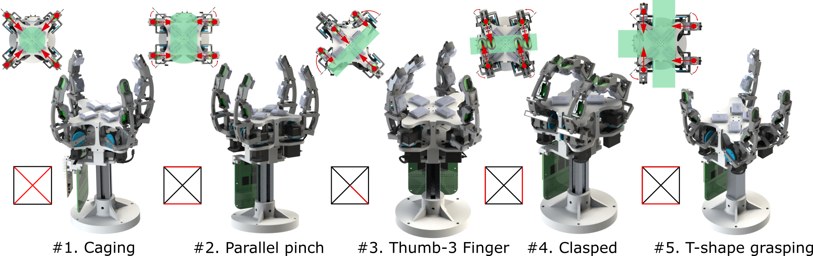
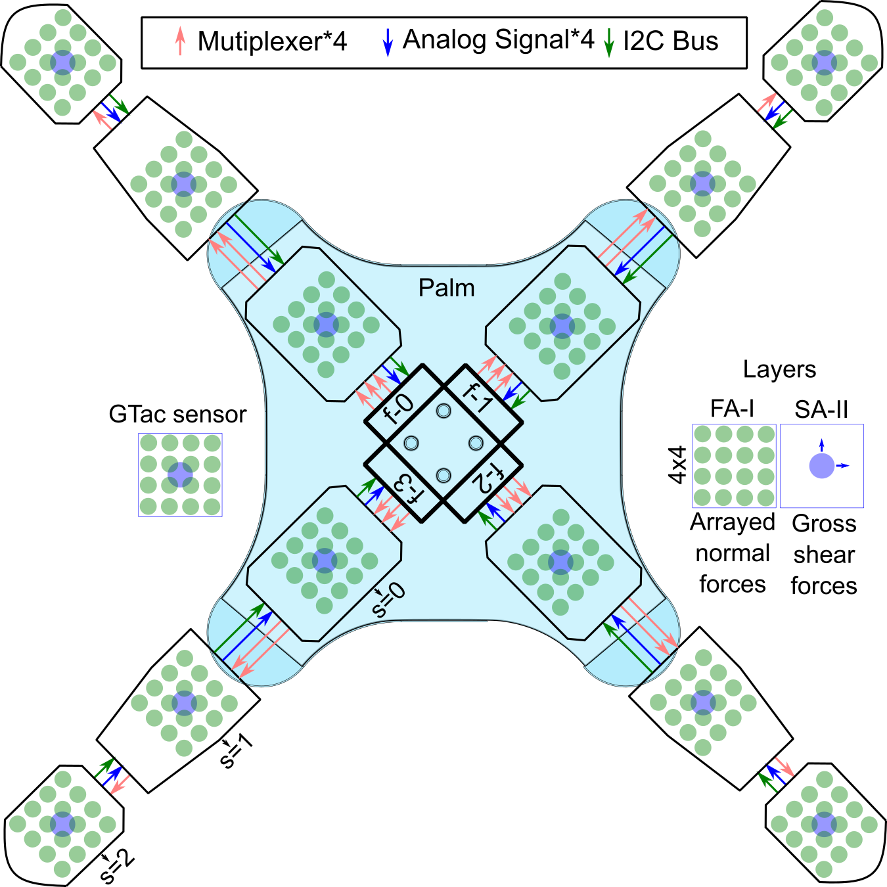
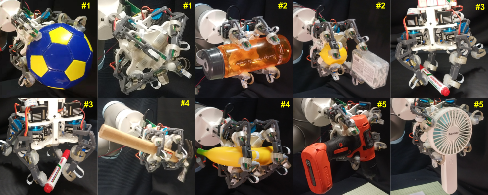

### GTac-Gripper: A Four-fingered Robotic Gripper with Reconfigurable Mechanism and Biomimetic Tactile Sensing Capabilities

<a href="https://roobooot.github.io/">Zeyu Lu</a>, 
<a href="https://wiki.nus.edu.sg/display/biorobotics/2021/01/13/Guo+Haotian">Haotian Guo</a>, 
Wensi Zhang,
<a href="https://cde.nus.edu.sg/bme/staff/dr-yuhy/">Haoyong Yu</a>

    <a href="https://github.com/roobooot/GTac_/tree/main/software/GTac_Gripper">[Code]</a>

> Abstract—Dexterity and tactile sensing have been the key
challenges for robotic grippers to interact with everyday objects
of various shapes and sizes, such as grasping and manipulation.
A reconfigurable mechanism with a multi-fingered
design enables grippers to perform multiple grasping gestures
for different objects. Moreover, tactile feedback is needed to
facilitate the grasping and manipulation tasks for a larger range
of objects with closed-loop control. Therefore, it is crucial to
develop a reconfigurable multi-fingered gripper with integrated
tactile sensing capabilities. In this letter, we present a robotic
gripper with a reconfigurable mechanism and biomimetic tactile
sensors integrated into the fingers and palm. Our gripper with
four adaptive fingers can perform 5 grasping gestures and
obtain 228 tactile feedback signals (normal and shear forces) in
150 Hz. We show that the gripper can grasp various everyday
objects and achieve in-hand manipulation including translation
and rotation with closed-loop control. This research provides a
new hardware design and could be beneficial to various robotic
applications in the domestic and industrial fields.

#### Acknowledgement
This project is supervised by <a href="https://www.eng.nus.edu.sg/bme/staff/dr-yuhy/">Prof. Haoyong Yu</a> in Biorobotics Lab @NUS. This work was supported by Agency for Science, Technology and
Research, Singapore, under the National Robotics Program, with A*star
SERC Grant No.: 192 25 00054.

##### Author contributions:
Conceptualization: Z.L., H.G., and H.Y.

Methodology: Z.L., H.G., and H.Y.

Investigation: Z.L. and H.G. 

Visualization: Z.L., H.G., and W.Z. 

Funding acquisition: H.Y.

Project administration: H.Y.

Supervision: H.Y.

Writing – original draft: Z.L. and H.G.

Writing – review & editing: Z.L., H.G., W.Z., and H.Y.

