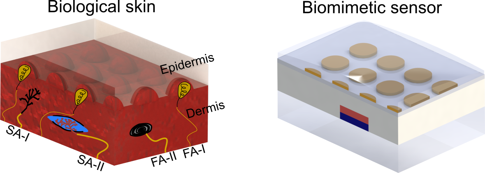
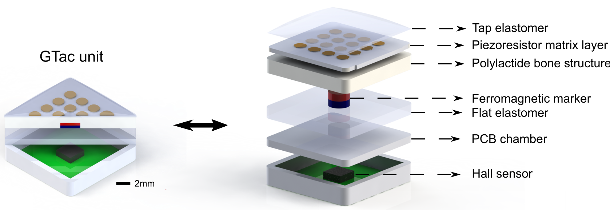

# Tactile Sensing for Robotics
This page is to introduce GTac and its integration with robotics.

## Papers 

--------------------
### GTac: A Biomimetic Tactile Sensor with Skin-like Heterogeneous Force Feedback for Robots

<a href="https://roobooot.github.io/">Zeyu Lu</a>, Xingyu Gao, <a href="https://cde.nus.edu.sg/bme/staff/dr-yuhy/">Haoyong Yu</a>

<p align="left">
    <a href="http://arxiv.org/abs/2201.12005">[Paper]</a>
    <a href="https://github.com/roobooot/GTac_/tree/main/software/GTac_Sensor">[Code]</a>
    <a href="https://youtu.be/Pmd8PvLpeUA">[Video]</a>
    <a href="./src/citations/gtac_sensor.txt">[Bibtex]</a>
</p>





<p align="center">
  
  
</p>

<p align="center">
  
  
</p>

> Abstract—Human hands can effectively perform daily activities, such as grasping 
and handovers of fragile objects, utilizing the tactile sensing 
capabilities which simultaneously perceive normal and shear forces 
via the mechanoreceptors highly integrated into the fingers and palm; 
here, human somatosensory systems leverage complex tactile feedback 
into patterns and identify the extrinsic contact states (ECSs) of objects 
in contact-rich tasks. Similarly, these features are still open issues and 
critical for robots in acquiring such human skills. In this letter, we integrate 
GTac sensors into a robotic hand, GTac-Hand, to obtain tactile feedback from its 
fingers and palm, resulting in 285 tactile measurements. Our results show that 
GTac-Hand can grasp delicate objects and precisely identify their ECSs via human-like
patterning and learning models, which can be used for robots to perform challenging 
tasks, such as delicate object grasping, object handovers, and ball-hit recognition.

[comment]: <> (Firstly, we designed and manufactured a biomimetic tactile sensor that can provide robots with normal and shear force sensing. Please check out our paper and the demo video!)


[comment]: <> (Z. Lu, X. Gao, and H. Yu, “GTac: A Biomimetic Tactile Sensor with Skin-like Heterogeneous Force Feedback for Robots,” arXiv:2201.12005 [cs], Jan. 2022. [Online]. Available: http://arxiv.org/abs/2201.12005)


#### Video
<p align="center">
<iframe width="560" height="315" src="https://www.youtube.com/embed/Pmd8PvLpeUA" title="YouTube video player" frameborder="0" allow="accelerometer; autoplay; clipboard-write; encrypted-media; gyroscope; picture-in-picture" allowfullscreen></iframe>
</p>

#### Citation 
```
@misc{lu2022gtac,
      title={GTac: A Biomimetic Tactile Sensor with Skin-like Heterogeneous Force Feedback for Robots}, 
      author={Zeyu Lu and Xingyu Gao and Haoyong Yu},
      year={2022},
      eprint={2201.12005},
      archivePrefix={arXiv},
      primaryClass={cs.RO}
}
```

<a href="./gtac_sensor.html">Link to GTac Sensor</a>

--------------------------------

### GTac-Hand: A Robotic Hand with Integrated Biomimetic Tactile Sensing and ECS Recognition Capabilities

<a href="https://roobooot.github.io/">Zeyu Lu</a>, 
<a href="https://wiki.nus.edu.sg/display/biorobotics/2021/01/13/Guo+Haotian">Haotian Guo</a>, 
<a href="https://wiki.nus.edu.sg/display/biorobotics/2020/10/01/David+Nicolas+Carmona+Moreno">David Carmona</a>, 
<a href="https://wiki.nus.edu.sg/display/biorobotics/2020/10/01/Shounak+Bhattacharya">Shounak Bhattacharya</a>, 
<a href="https://cde.nus.edu.sg/bme/staff/dr-yuhy/">Haoyong Yu</a>

<p align="left">
    <a href="https://github.com/roobooot/GTac_/tree/main/software/GTac_Hand">[Code]</a>
</p>


> Abstract—Human hands can effectively perform daily activities,
such as grasping and handovers of fragile objects,
utilizing the tactile sensing capabilities which simultaneously
perceive normal and shear forces via the mechanoreceptors
highly integrated into the fingers and palm; here, human
somatosensory systems leverage complex tactile feedback into
patterns and identify the extrinsic contact states (ECSs) of
objects in contact-rich tasks. Similarly, these features are still
open issues and critical for robots in acquiring such human
skills. In this letter, we integrate GTac sensors into a robotic
hand, GTac-Hand, to obtain tactile feedback from its fingers
and palm, resulting in 285 tactile measurements. Our results
show that GTac-Hand can grasp delicate objects and precisely
identify their ECSs via human-like patterning and learning
models, which can be used for robots to perform challenging
tasks, such as delicate object grasping, object handovers, and
ball-hit recognition.

### GTac-Gripper: A Four-fingered Robotic Gripper with Reconfigurable Mechanism and Biomimetic Tactile Sensing Capabilities

<a href="https://roobooot.github.io/">Zeyu Lu</a>, 
<a href="https://wiki.nus.edu.sg/display/biorobotics/2021/01/13/Guo+Haotian">Haotian Guo</a>, 
Wensi Zhang,
<a href="https://cde.nus.edu.sg/bme/staff/dr-yuhy/">Haoyong Yu</a>

<p align="left">
    <a href="https://github.com/roobooot/GTac_/tree/main/software/GTac_Hand">[Code]</a>
</p>


> Abstract—Dexterity and tactile sensing have been the key
challenges for robotic grippers to interact with everyday objects
of various shapes and sizes, such as grasping and manipulation.
A reconfigurable mechanism with a multi-fingered
design enables grippers to perform multiple grasping gestures
for different objects. Moreover, tactile feedback is needed to
facilitate the grasping and manipulation tasks for a larger range
of objects with closed-loop control. Therefore, it is crucial to
develop a reconfigurable multi-fingered gripper with integrated
tactile sensing capabilities. In this letter, we present a robotic
gripper with a reconfigurable mechanism and biomimetic tactile
sensors integrated into the fingers and palm. Our gripper with
four adaptive fingers can perform 5 grasping gestures and
obtain 228 tactile feedback signals (normal and shear forces) in
150 Hz. We show that the gripper can grasp various everyday
objects and achieve in-hand manipulation including translation
and rotation with closed-loop control. This research provides a
new hardware design and could be beneficial to various robotic
applications in the domestic and industrial fields.

### Acknowledge
This project is supervised by <a href="https://www.eng.nus.edu.sg/bme/staff/dr-yuhy/">Prof. Haoyong Yu</a> in Biorobotics Lab @NUS.
