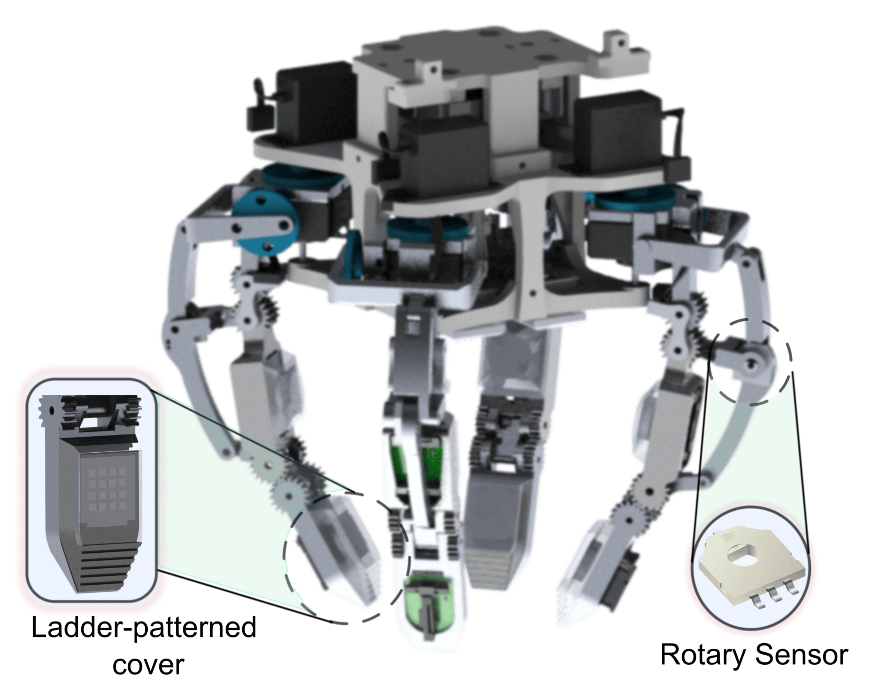

# A Biomimetic Tactile Sensor Design
This page is to list the papers about GTac and its integration with robotics, for instance, GTac-Hand and GTac-Gripper.

---------------------------------
## Papers 

### GTac: A Biomimetic Tactile Sensor with Skin-like Heterogeneous Force Feedback for Robots

Zeyu Lu, Xingyu Gao, and Haoyong Yu 

(published in IEEE Sensors Journal)

    <a href="https://doi.org/10.1109/JSEN.2022.3181128">[Paper]</a>
    <a href="https://github.com/roobooot/GTac_/tree/main/software/GTac_Sensor">[Code]</a>
    <a href="./gtac_sensor.html">[Website]</a>
    <a href="https://youtu.be/Pmd8PvLpeUA">[Video]</a>
    <a href="./src/citations/gtac_sensor.txt">[Bibtex]</a>

--------------------------------

### GTac-Hand: A Robotic Hand with Integrated Biomimetic Tactile Sensing and ECS Recognition Capabilities

Zeyu Lu, Haotian Guo, David Carmona, Shounak Bhattacharya, and Haoyong Yu 

(submitted to IEEE Transactions on Mechatronics)

[comment]: <> (![art]&#40;./src/img/gtac_hand_rendering_0.JPG &#41;)

    <a href="./gtac_hand.html">[Website]</a>
    <a href="https://github.com/roobooot/GTac_/tree/main/software/GTac_Hand">[Code]</a>

---------------------------------------------------

### GTac-Gripper: A Reconfigurable Under-actuated Four-fingered Robotic Gripper with Tactile Sensing

Zeyu Lu, Haotian Guo, Wensi Zhang, and Haoyong Yu 

(published in IEEE RA-L)

    <a href="https://doi.org/10.1109/LRA.2022.3181370">[Paper]</a>
    <a href="./gtac_gripper.html">[Website]</a>
    <a href="https://youtu.be/44X5uXroEYc">[Video]</a>
    <a href="https://github.com/roobooot/GTac_/tree/main/software/GTac_Hand">[Code]</a>

---------------------------------------------------

### Robotic Interaction Control on Deformable Objects via Tactile Feedback

Hanwen Zhang*, Zeyu Lu*, Wenyu Liang, Haoyong Yu, Yao Mao, and Yan Wu

* indicates equal contributions

(Submitted to IEEE RA-L)

---------------------------------------------------

### GTac-Gripper V2 with Epicyclic Joints and Reconfigurability-Based Tactile Features Argumentation

Haotian Guo*, Zeyu Lu*, Tian Lyu, and Haoyong Yu 

* indicates equal contributions

(Submitted to ICRA2023)

-----------------------------
### Acknowledge
This project is supervised by <a href="https://www.eng.nus.edu.sg/bme/staff/dr-yuhy/">Prof. Haoyong Yu</a> in Biorobotics Lab @NUS. This work was supported by Agency for Science, Technology and
Research, Singapore, under the National Robotics Program, with A*star
SERC Grant No.: 192 25 00054.

Please visit our <a href="https://github.com/roobooot/GTac_">[github repo]</a>.
